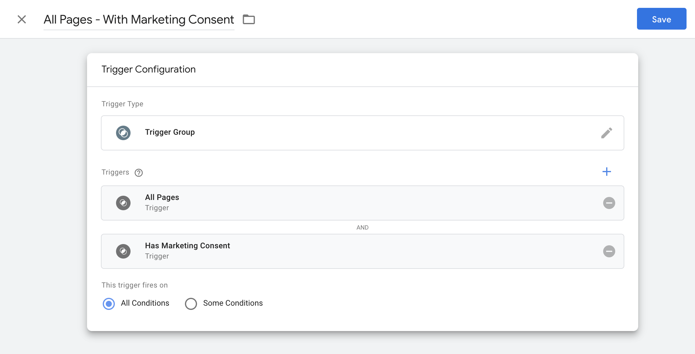

# Google Tag Manager Consent Integration

Support for Google Tag Manager (GTM) can be added via GTM's data layer variable.

You will need to add the following PHP file to your application somewhere and load it. It can be a `mu-plugin`, or part of a theme for example.

```php
<?php
/**
 * Altis Consent Tag Manager Integration
 */

namespace Altis\Consent\GTM;

add_action( 'wp_enqueue_scripts', __NAMESPACE__ . '\\enqueue_scripts', 11 );

/**
 * Add inline tag manager script to Consent API JS.
 */
function enqueue_scripts() {
	wp_add_inline_script(
		'altis-consent',
		sprintf(
			// Ensure data layer variable is available.
			'var %1$s = window.%1$s || [];' .
			// Push initial consented categories into data layer.
			'%1$s.push( { event: \'altis-consent-changed\', altisConsent: Altis.Consent.getCategories().join( \', \' ) + \',\' } );' .
			// Listen for updates to consented categories.
			'document.addEventListener( \'wp_listen_for_consent_change\', function () { %1$s.push( { event: \'altis-consent-changed\', altisConsent: Altis.Consent.getCategories().join( \', \' ) + \',\' } ) } );',
			// If using the HM GTM plugin this will ensure the right data layer variable name is used.
			apply_filters( 'hm_gtm_data_layer_var', 'dataLayer' )
		),
		'after'
	);
}
```

When either the page loads or consent is subsequently changed the data layer is updated allowing you to create triggers based on the consent given.

The event name is `altis-consent-changed` and the variable is named `altisConsent`. The variable data is a list of the [consent categories](./consent-api.md#consent-categories) currently given for example "functional, statistics-anonymous".

## Creating the Variable

To get started in GTM first navigate to Variables in the left hand sidebar and on User-Defined variables panel click "New".

- For the name enter something like **"Cookie Consent Categories"**
- For the variable type choose **"Data Layer Variable"**
- For the Data Layer Variable Name enter `altisConsent`
- Save the new variable


## Creating Triggers

Triggers in GTM can be used to block the execution of certain tags by adding them as exceptions. We recommend this method to check if consent is missing before firing a given tag.

Due to the way GTM works it is required to create trigger groups to combine default triggers like "All pages" with triggers for changes to consent.

### Consent Trigger

You will need to create a trigger for each category of consent you need to check when firing tags. Navigate to the Triggers section on the left hand sidebar and then click "New".


- For the name enter **"Has Marketing Consent"**
   - replace **"Marketing"** with whichever category your trigger will be for
- For the trigger type choose **"Custom Event"**
- For the Event Name enter `altis-consent-changed`
- Select **"Some custom events"** for when the trigger should fire and options to create conditions will appear
- From the list of variables select your **"Cookie Consent Categories"** variable from earlier
- Select **"contains"** as the operator
- Enter **"marketing"** as the text the variable should contain
   - again replace **"marketing"** with the category you are adding
- Save the trigger

**Note:** if you have 2 categories with similar text e.g. "statistics" and "statistics-anonymous" you can add a comma after the name to get an exact match, for example "statistics,"

Repeat the above steps for each consent category you need.

### Combined Trigger

Next you will need to create a trigger group combining the consent trigger and your desired primary trigger, most of the time this is the "All Pages" trigger.



Again, navigate to the Triggers section on the left hand sidebar and then click "New".

- For the name enter **"All Pages - With Marketing Consent"**
   - replace **"All Pages"** with your primary trigger name
   - replace **"Marketing"** with whichever consent category trigger you are combining this with
- For the trigger type choose **"Trigger Group"**
- Under **"Triggers"** add a new trigger, select **"All Pages"**, or whichever primary trigger you wish
- Add another trigger, this time select the **"Has Marketing Consent"** trigger you created in the previous section
- Save the trigger

You will need to do this for each consent category & primary trigger event you need.

Once you are done you can start using these triggers to ensure only the tags that your website visitors have consented to are loaded by adding the trigger(s) that check the required consent categories as "Firing Triggers" to your tags.


