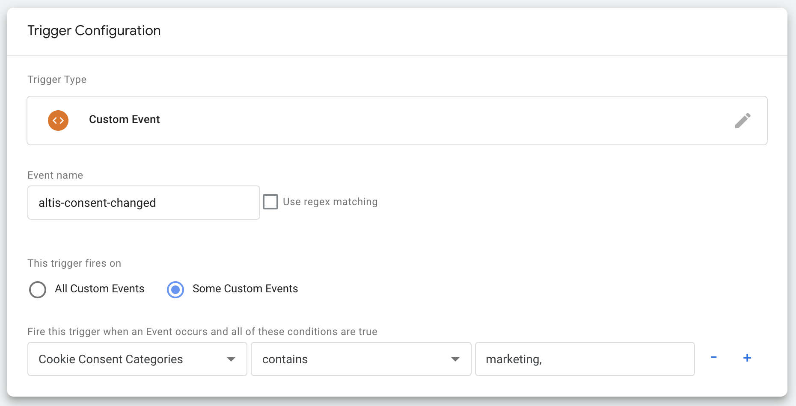

# Google Tag Manager Consent Integration

Support for Google Tag Manager is provided via GTM's data layer variable. When either the page loads or consent is subsequently changed the data layer is updated allowing you to create triggers based on the consent given.

The event name is `altis-consent-changed` and the variable is named `altisConsent`. The variable data is a list of the [consent categories](./Consent-API.md#consent-categories) currently given for example "functional, statistics-anonymous".

## Creating the Variable

To get started in GTM first navigate to Variables in the left hand sidebar and on User-Defined variables panel click "New".

- For the name enter something like **"Cookie Consent Categories"**
- For the variable type choose **"Data Layer Variable"**
- For the Data Layer Variable Name enter `altisConsent`
- Save the new variable

## Creating Triggers

Triggers in GTM can be used to block the execution of certain tags by adding them as exceptions. We recommend this method to check if consent is missing before firing a given tag.

You will need to create a trigger for each category of consent you need to check when firing tags. Navigate to the Triggers section on the left hand sidebar and then click "New".

- For the name enter **"Marketing Consent Missing"**
   - replace **"Marketing"** with whichever category your trigger will be for
- For the trigger type choose **"Custom Event"**
- For the Event Name enter `altis-consent-changed`
- Select **"Some custom events"** for when the trigger should fire and options to create conditions will appear
- From the list of variables select your **"Cookie Consent Categories"** variable from earlier
- Select **"does not contain"** as the operator
- Enter **"marketing"** as the text the variable should contain
   - again replace **"marketing"** with the category you are adding
- Save the trigger

**Note:** if you have 2 categories with similar text e.g. "statistics" and "statistics-anonymous" you can add a comma after the name to get an exact match, for example "statistics,"

Repeat the above steps for each consent category you need.

Once you are done you can start using these triggers to ensure only the tags that your website visitors have consented to are loaded by clicking "Add Exception" and selecting the trigger(s) that check the required consent categories.

